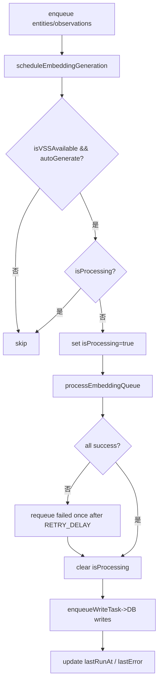

# Non-blocking Embedding Phase 2.5 強化計畫（個人模式）

## 1. 背景與目標

### 背景分析
- Phase 2 已交付 non-blocking embedding 生成（debounce + 批次處理 + DuckDB 寫入）。
- 目前主要為個人使用情境，低併發、非高壓環境，追求小改動快速落地。
- 需對齊專案佇列/併發原則，避免直連 DB 寫入；同時保持介面穩定與易維護。

### 目標設定
- 主要目標：
  1) 防重入（互斥）與健康檢查 gate。
  2) 最小重試（同批一次、固定延遲）。
  3) 最小觀測性（狀態/錯誤欄位、結構化日誌）。
  4) 嵌入寫入熱點以最小包覆接入 request-queue / concurrency-controller。
- 次要目標：維持非阻塞特性與良好效能；文件與設定同步。

### 非目標
- 不實作複雜優先級、timeout、Dead-Letter Queue（DLQ）與多層退避策略。
- 不針對高壓負載進行進階調優（個人使用優先）。

### 約束條件
- 佇列/鎖控：所有 DuckDB 突變需經由既有 `request-queue` / `concurrency-controller`。
- 安全原則：使用參數化查詢、固定語句模板；避免繞過臨界區。
- 介面穩定：不改變對外 API；僅內部強化。

## 2. 需求分析

### 功能需求
- 防重入：`processEmbeddingQueue` 單一執行；`scheduleEmbeddingGeneration` 執行前檢查。
- 健康 gate：執行前檢查 `isVSSAvailable()` 與 `autoGenerate`。
- 最小重試：同批失敗項目重排一次（固定延遲 `EMBEDDING_RETRY_DELAY_MS`，預設 1500ms）。
- 最小觀測性：`getEmbeddingQueueStatus` 回傳 `isProcessing`、`lastRunAt`、`lastError`。
- 佇列對齊（最小）：兩處嵌入寫入改走 `enqueueWriteTask` 包覆 DB 寫入。
- 手動觸發：保留 `scheduleEmbeddingGeneration()` 供手動復跑。

### 非功能需求
- 小改動、可快速落地；維持非阻塞主路徑；易除錯與維護。

## 3. 技術方案設計

### 方案評估
| 方案 | 優點 | 缺點 | 風險 | 建議 |
|------|------|------|------|------|
| 最小強化（本計畫） | 改動小、快速上線、風險低 | 不含高壓保護與 DLQ | 失敗聚集需人工介入 | ✓ |
| 完整硬化（先前 2.5 草案） | 面向高壓、可觀測性完整 | 工時較大、侵入性高 | 導入成本高 | 觀望 |

### 架構設計（模組與責任）
- `EmbeddingQueueManager`
  - 新增：`isProcessing`、健康 gate、單次重試、狀態欄位、結構化日誌。
  - 變更：`updateEntityEmbeddingInDB` / `updateObservationEmbeddingInDB` 改呼叫 `enqueueWriteTask`。
- `DuckDBKnowledgeGraphManager`
  - 暴露/轉接：`enqueueWriteTask(fn)` 供嵌入寫入包覆使用。
- 佇列/鎖控
  - 沿用現有 `request-queue` 與 `concurrency-controller`（不新增優先級/timeout）。

## 4. 執行計畫流程圖

## 5. 詳細實作步驟（建議順序）

### 階段一：互斥/健康 gate/狀態（~0.5 天）
- [ ] `EmbeddingQueueManager`
  - [ ] 新增 `isProcessing`；所有路徑 `finally` 清理。
  - [ ] `scheduleEmbeddingGeneration` / `processEmbeddingQueue` 前置檢查 `isVSSAvailable()` 與 `autoGenerate`。
  - [ ] 擴充 `getEmbeddingQueueStatus`：`isProcessing`、`lastRunAt`、`lastError`。
  - [ ] 結構化日誌：queue size、duration、tokens、錯誤摘要。

### 階段二：最小重試（~0.5 天）
- [ ] 設定 `EMBEDDING_RETRY_DELAY_MS`（預設 1500ms，可選）。
- [ ] 同批失敗項目重排一次（固定延遲），不引入 DLQ。
- [ ] 確保不重入：延遲計時到期時亦需檢查健康與 `isProcessing`。

### 階段三：佇列對齊（最小包覆）（~0.5–1 天）
- [ ] `DuckDBKnowledgeGraphManager`
  - [ ] 暴露 `enqueueWriteTask(fn)`（若已存在則沿用）。
- [ ] `EmbeddingQueueManager`
  - [ ] `updateEntityEmbeddingInDB` / `updateObservationEmbeddingInDB` 以 `enqueueWriteTask` 包覆 DB 寫入。

### 階段四：輕量測試與文件（~0.5 天）
- [ ] 單元測試：
  - [ ] 防重入：多次 enqueue 僅一次處理。
  - [ ] 最小重試：伺服器暫失時可重排一次。
  - [ ] 狀態 API：`isProcessing/lastRunAt/lastError`。
- [ ] 文件：新增「個人模式」建議值與故障處理（如何手動重跑）。

## 6. 測試策略

### 測試層級
1. 單元測試：`EmbeddingQueueManager` 的互斥、重試、狀態欄位。
2. 整合測試：嵌入寫入透過 `enqueueWriteTask`，在多次 enqueue 下無重入異常。
3. 煙囪測試：從 `createEntities` / `addObservations` 觸發到最終寫入的最小路徑驗證。

### 覆蓋重點
- 非阻塞：主路徑呼叫不被背景處理阻塞。
- 型別與 SQL：`FLOAT[]` 字串化與 cast 正確。
- 健康降級：不健康時跳過，恢復後可手動或自動復跑。

## 7. 風險管理

| 風險 | 可能性 | 影響度 | 緩解措施 | 應變 |
|------|--------|--------|----------|------|
| 重入導致重複寫入 | 低 | 中 | `isProcessing` + finally 清理 | 額外保護性檢查 |
| 單次重試仍失敗 | 中 | 低 | 保留在 queue，提示手動重跑 | 文件化手動重跑步驟 |
| 佇列包覆遺漏 | 低 | 中 | code review/測試覆蓋兩處寫入 | 快速修補並回測 |

## 8. 依賴與資源
- 既有：`request-queue`、`concurrency-controller`、OpenAI Embedding Service。
- 設定：`EMBEDDING_AUTO_GENERATE`、`EMBEDDING_DEBOUNCE_MS`、`EMBEDDING_BATCH_SIZE`、`EMBEDDING_MAX_RETRIES`、`EMBEDDING_RETRY_DELAY_MS`（新增可選）。

## 9. 成功指標與驗證
- 功能性：
  - 無重入（連續觸發僅一次處理）。
  - 同批失敗可重排一次且不影響主路徑。
  - 嵌入寫入均經 `enqueueWriteTask`。
- 可觀測性：狀態欄位與日誌可快速定位問題。

## 10. 時程規劃

### 里程碑
- M1：互斥/健康 gate/狀態完成（~0.5 天）。
- M2：最小重試完成（~0.5 天）。
- M3：佇列包覆完成（~0.5–1 天）。
- M4：輕量測試與文件完成（~0.5 天）。

### 關鍵路徑
1. `isProcessing` 與 finally 清理必須正確，否則影響後續處理。
2. 佇列包覆需確認兩處寫入都已走 wrapper，避免漏網直連寫入。

## 11. 溝通計畫
- 每完成一個階段更新 workflow scratchpad（附狀態/前後對比）。
- 若遇到阻塞（如 API 健康長期不良），即時記錄問題與暫解。

## 12. 後續維護
- 需要時可平滑升級至完整硬化（多次退避 + DLQ + 優先級/timeout + 指標化）。
- 維護建議：將指標與狀態輸出納入簡易監控指令（CLI/腳本）。

